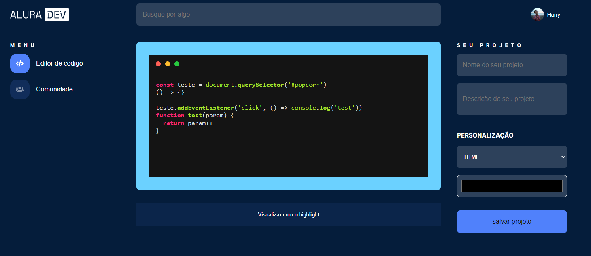

# **ALURA DEV - o centro de compartilhamento de código**

## Como funciona? 
- na página principal, ponha seu código no container principal.
- caso queira visualizar com a estilização adequada, clique em "Visualizar com o highlight"
- Dê um título e uma breve descrição do seu projeto, defina a tecnologia usada no código e uma cor de borda.
- Poste para a comunidade em "salvar projeto"

## Tecnologias utilizadas na construção do projeto
- JS
- SCSS
- HTML

## Como rodar o projeto?
não é necessário instalar dependências, ao clonar o repositório você ja terá o necessário

você pode ver o projeto rodando acessando [aqui](https://alura-dev-theta.vercel.app/)

